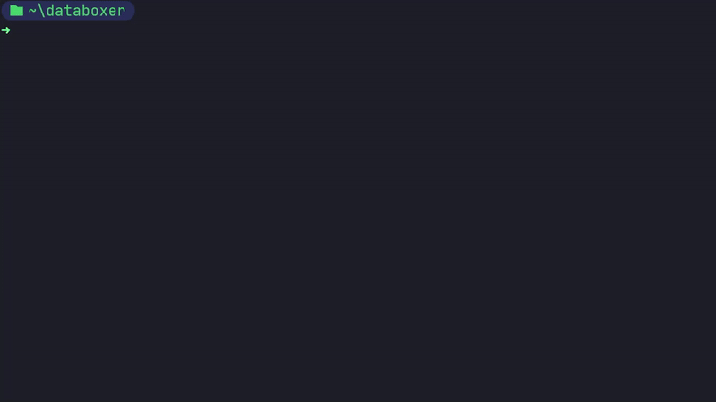
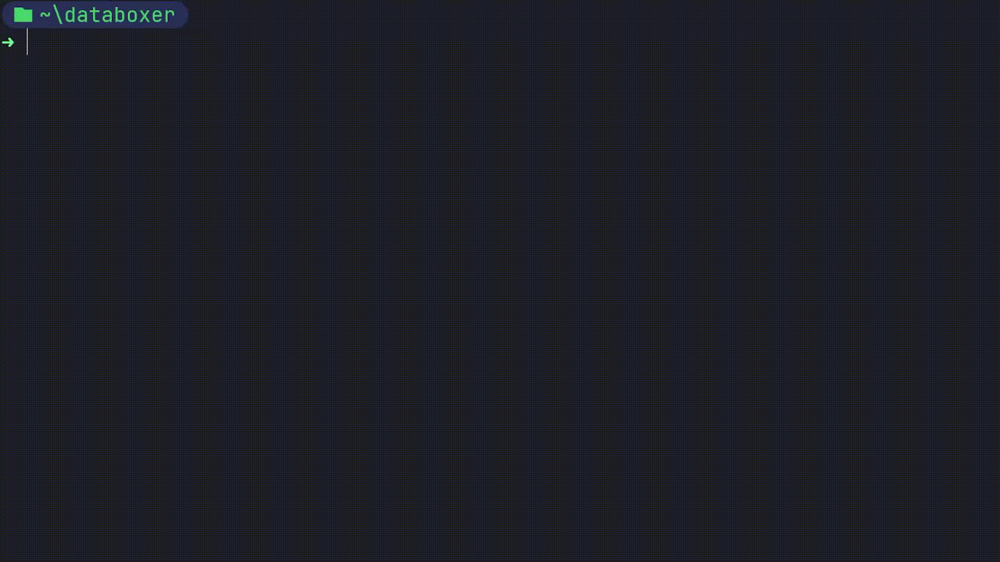

<div align="center">
    
    <h1>Databoxer</h1>
</div>

> A data encryption program, which focuses on speed, safety and user-friendliness


- [About](#-about)
- [Features](#-features)
- [Installation](#-installation)
- [Usage](#-usage)
- [Development](#-development)

## About

Databoxer aims to be a lightweight cross-platform solution for file encryption, while also being efficient and safe. **It is not a drop-in replacement** for already long-existing
encryption tools, such as _Bitlocker_, but instead more of an alternative.

It is aimed at both average and more advanced users. Possible use cases can range from simple local data protection
and access restriction to wireless data transfer and removable drive safety insurance. It's up to the user to decide
how to use the program, which is one of the Databoxer's key principles: to **be flexible and efficient**.

Databoxer operates based on the **ChaCha20** encryption algorithm in combination with the **Poly1305** universal hash
function to perform its encryption operations. It proved to be much more safe and fast than the most popular **AES**
algorithm used in many other similar programs. The files are encrypted using a randomly generated 32-byte _encryption
key_ and per-file 12-byte _nonce_, which ensures ciphertext's uniqueness across different files.

## Installation

Databoxer is cross-platform and is supported on all major platforms (Windows, Linux and macOS)

> [!NOTE]
> The latest release of Databoxer has all the core features fully implemented, but it is still considered to be a 
> **beta** version. Many of those features are still being expanded upon and many new ones will be added. Consider all
> versions under `1.0.0` to be prone to many interface, functionality and API changes.

### With Cargo

_This is the recommended way to install Databoxer_

```shell
cargo install databoxer
```

### From releases

1. Go to [Releases](https://github.com/duckysmacky/databoxer/releases)
2. Select the version you want to download
3. Download the binary for your system (Windows, Linux or macOS)

### From source

_From latest commit at `master` branch via Cargo_

```shell
cargo install --git https://github.com/duckysmacky/copper.git
```

## Features

### Profile system

One of the key features of Databoxer is its **profile management system**. The user of the application can create
different profiles in order to store keys and manage encrypted files. Each profile has a unique encryption key which 
is used to encrypt/decrypt files and can be protected by user-defined password.

_Later down the line Databoxer is planned to have support for native keyring toolchains, such as GnuPG, Kleopatra and
CryptoAPI (CNG) (for Windows)._

### Boxfile file format

The encrypted files are "boxed" into a `.box` file and stored in that way on the drive. A Boxfile (`.box` file) is a 
custom file format which uses different techniques in order to ensure safety of the data, verify its content integrity
and embed additional information about the file.

## Usage

Currently, the program provides a CLI which is used for all major operations. The program can be run with
`databoxer <COMMAND>`. The complete list of commands can be viewed with `databoxer --help`. Below are shown usage
examples of some of the main commands.

### Encrypting files

<details>
  <summary>
    Example demonstration (click to expand)
  </summary>
  <div>
      
  </div>
</details>

```shell
databoxer box <PATH>...
```

Multiple paths can be supplied for multi-file encryption, as well as directories (with optional recursive feature `-R`).

Output files will be encrypted and formatted into a custom `.box` file type with a random UUID as a name. User also
can specify the output location for each file with a `-o` flag. Additionally, the user can also enable metadata
encryption with the `-e` flag, which will encrypt the file's metadata (name, size, etc.).

### Decrypting files

<details>
  <summary>
    Example demonstration (click to expand)
  </summary>
  <div>
      
  </div>
</details>

```shell
databoxer unbox <PATH>...
```

Functions similarly to encryption: support for multiple paths and directories. The original file name can be supplied
instead of a UUID to easily identify files (only if the metadata encryption wasn't enabled during encryption).

The input files have to have a `.box` file type. During decryption the program will restore original file name and
extension.

### Configuring profiles

<details>
  <summary>
    Example demonstration (click to expand)
  </summary>
  <div>
    
  </div>
</details>

```shell
databoxer profile <ACTION>
```

A new profile can be created with the `profile new` command. Each profile should have a name and password, which is
asked every time a profile-related feature is used by the user (e.g. encryption, as it requires profile's encryption
key).

Other profile manipulation actions include `select` which profile to use, `delete` to delete one and `list` to list
all other existing profiles.

### Manipulating encryption keys

<details>
  <summary>
    Example demonstration (click to expand)
  </summary>
  <div>
    
  </div>
</details>

```shell
databoxer key <ACTION>
```

The `key` subcommand is used to control the profile's stored encryption key. It can be outputted it in a formatted hex
string using the `key get` command.

A new key can be created with the `key new` command, generating a fresh encryption key and overwriting the old one. A
key can also be set from the outside (using a hex string) using the `key set <KEY>` command. The key has to be a 32-byte
key to be accepted (refer to `key get` command's output for how the key should look to be valid).

## Development

As stated previously this project is in very active development. The current implementation of many things might
completely change by the time it is fully released (`1.0.0`).

### Roadmap

_These plans could change during future development_

- [x] User profile system
- [x] `.box` file format
- [x] Multiple profiles/keys support
- [ ] Support for custom user config (using `config.toml`)
- [ ] File data compression
- [ ] Improved profile storage (local database)
- [ ] Batch file encryption (`boxfile` archive)
- [ ] OS-native toolchain support (GnuPG, Kleopatra, CryptoAPI, etc.)
- [ ] GUI interface

### Contribution

Any kind of contribution is very welcomed! The codebase is well-documented and actively maintained, so it would not
be too hard to get started with it.
